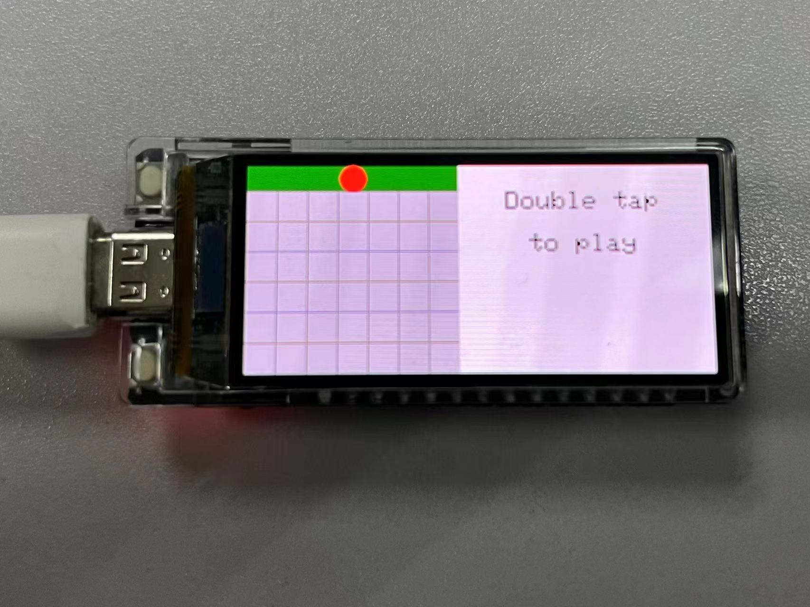
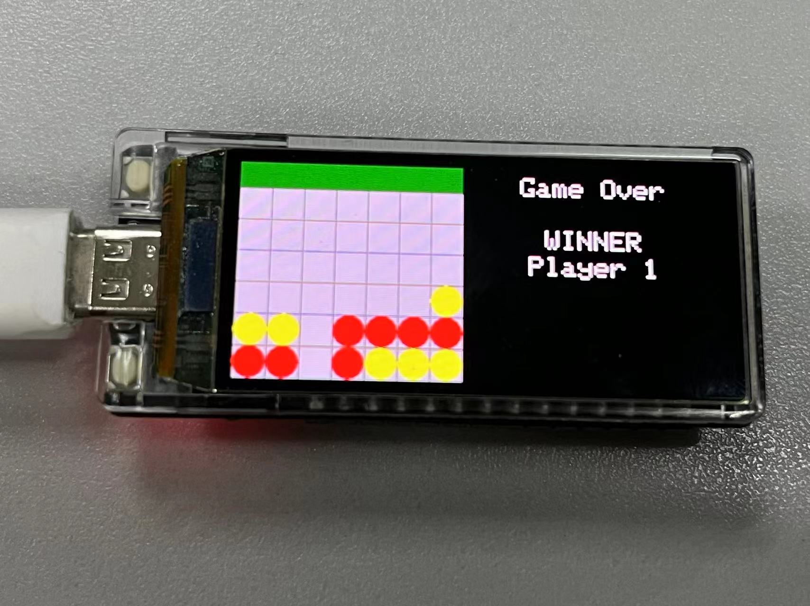

# ESP32 四子棋游戏

本项目在 ESP32 开发板上实现了双人对战四子棋游戏。

## 功能特性
- MCU: ESP32-S3 (<a href="https://github.com/Xinyuan-LilyGO/T-Display-S3-AMOLED">T-Display-S3-AMOLED</a>)
- 屏幕驱动: RM67162
- 屏幕尺寸: 536 x 240

## 安装使用

1. 克隆项目到本地
2. 打开 PlatformIO 并导入项目
3. 无需配置额外配置 TFT_eSPI 库中内容，但请确保 ``pins_config.h, rm67162.cpp, rm67162.cpp`` 与main文件在同级目录在
4. 测试上传

## 更多教程
<a href="https://www.bilibili.com/video/BV1XJ4m1a7d7/?share_source=copy_web&vd_source=3c57c402ce6608c6e7e068397d883cea">视频教程</a>
